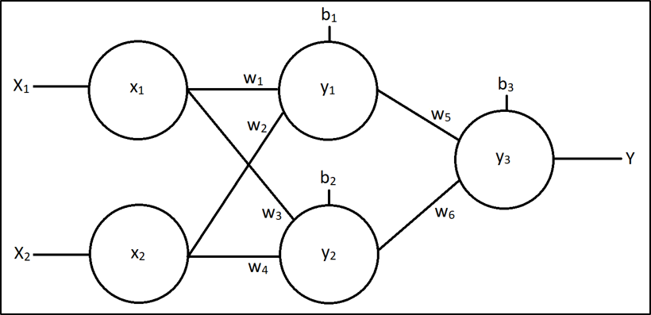

# Övningstentamen 1 - Neurala nätverk och testning

## Information
Denna tentamen är gemensam för kurserna **Maskininlärning** och **Mjuk- och hårdvarutestning**:
* Uppgift 1–7 examinerar maskininlärning.
* Uppgift 8–10 examinerar testning. 

Betyg sätts separat per kurs enligt poänggränserna nedan.

### Hjälpmedel
* En A4 med anteckningar.
* Dator med textredigerare (t.ex. Visual Studio Code med IntelliSense).
* Kodkomplettering, AI-verktyg och internetåtkomst är inte tillåtna.

### Poänggränser och betygsnivåer

**Maskininlärning (uppgift 1–7):**
Totalt: 30 poäng.

Betygsgränser:
* **G:** Minst 14 poäng.
* **VG:** Minst 23 poäng.

Bidrag till kursens slutpoäng:
* Betyget **G** ger 1 poäng till kurssammanställningen.
* Betyget **VG** ger 2 poäng till kurssammanställningen.

**Mjuk- och hårdvarutestning (uppgift 8–10):**
Totalt: 20 poäng.

Betygsgränser:
* **G:** Minst 10 poäng.
* **VG:** Minst 16 poäng.

Bidrag till kursens slutpoäng: se separat information för kursen Mjuk- och hårdvarutestning.

### Viktigt
* Ett komplett neuralt nätverk (inklusive `ml::neural_network::Shallow`) tillhandahålls i katalogen [code](./code/source/main.cpp). 
* Er uppgift är enbart att skapa och implementera klassen `Dense` i filerna [ml/dense_layer/dense.h](./code/include/ml/dense_layer/dense.h) samt [ml/dense_layer/dense.cpp](./code/source/ml/dense_layer/dense.cpp); resten av kodbasen ska inte behöva ändras, förutom att ni behöver kommentera ut `-DSTUB`
* Hjälpfunktionerna `ml::actFuncOutput()` samt `ml::actFuncDelta()` finns redan tillgängliga och stödjer båda aktiveringsfunktionerna `ActFunc::Relu` samt `ActFunc::Tanh`, ni behöver alltså inte implementera dessa själva.
* Koden behöver ej kommenteras.
* I givet testprogram används dense-lagerstubbar i form av `ml::dense_layer::Stub`. För att använda er implementation `ml::dense_layer::Dense` i stället, kommentera ut `-DSTUB` ur [Makefile](./code/Makefile), såsom visas nedan:

```bash
CXX_FLAGS := -Wall -Werror -std=c++17 -Iinclude #-DSTUB
```

* Uppgift 8–10 (testning) använder testramverket `yrgo::test` (se [libs/test](../../libs/test/README.md) för `TEST()`, `EXPECT_*` med mera). Testerna ligger i katalogen [test](./code/test), som har en egen makefil; bygg och kör dem genom att köra `make` i den katalogen.
* `ml::dense_layer::Stub` har en metod `setOutput()` som låter er sätta lagrets utdata manuellt; använd denna för att skriva komponenttester för `Shallow` med kända, kontrollerade lagerutdata.

---

## G-uppgifter

### **1.** Klassen `Dense` (4p)
Skapa en klass döpt `Dense` i namnrymden `ml::dense_layer` som ärver (publikt) interfacet `ml::dense_layer::Interface`:
* Klassen ska inte kunna ärvas vidare.
* Konstruktorn ska inte kunna anropas implicit (t.ex. vid en typkonvertering).
* Objekt av klassen ska varken kunna skapas utan angivna argument, kopieras eller flyttas.
* Konstruktorn ska skriva ut ett felmeddelande och anropa `std::terminate()` om `nodeCount` eller `weightCount` är 0.

---

### **2.** Feedforward (4p)
Implementera metoden `feedforward()` i klassen `Dense`. Metoden ska:
* Genomföra den fullständiga feedforward-beräkningen och lagra resultatet internt så att det returneras korrekt via `output()`.
* Fungera korrekt oavsett vald aktiveringsfunktion (`ActFunc::Relu` eller `ActFunc::Tanh`).
* Skriva ut ett felmeddelande och returnera `false` om dimensionen på `input` inte matchar antalet vikter per nod (annars `true`).

---

### **3.** Feedforward för hand (4p)
Ni har följande enkla neurala nätverk:



* Ingångslager: 2 insignaler `x1`, `x2`.
* Dolt lager: 2 noder `y1`, `y2`.
* Utgångslager: 1 nod `y3`.
* Aktiveringsfunktion: **ReLU** i samtliga noder.

**Parametrar:**
```
b1 = 0.1,  b2 = 0.4,  b3 = 0.2
w1 = 0.3,  w2 = 0.7  (till y1, från x1 respektive x2)
w3 = 0.5,  w4 = 0.2  (till y2, från x1 respektive x2)
w5 = 0.6,  w6 = 0.9  (till y3, från y1 respektive y2)
```

**Indata:** `x1 = 1`, `x2 = 0`.

Beräkna, med visad uträkning, värdena på `y1`, `y2` samt `y3` via feedforward.

---

### **4.** Aktiveringsfunktioner (2p)
Besvara följande kortfattat:
* Förklara vad det innebär att gradienter kan "försvinna" (*vanishing gradients*) under träning, och varför ReLU minskar risken för detta jämfört med sigmoid.
* En utgångsnod ska predicera ett värde i intervallet `[-1, 1]`. Vilken aktiveringsfunktion lämpar sig bättre för detta – ReLU eller Tanh – och varför?

---

## VG-uppgifter

### **5.** Backpropagation och optimering (8p)
Implementera metoderna `backpropagate()` (två överlagringar) samt `optimize()` i klassen `Dense`. Samtliga metoder ska fungera korrekt oavsett vald aktiveringsfunktion (`ActFunc::Relu` eller `ActFunc::Tanh`).

**`backpropagate(output)`** (utgångslager):
* Ska beräkna felet för varje nod utifrån referensvärdena i `output` och lagra det internt, så att det kan hämtas via `error()` samt användas av `optimize()`.
* Skriv ut ett felmeddelande och returnera `false` om dimensionen på `output` inte matchar antalet noder i lagret (annars `true`).

**`backpropagate(nextLayer)`** (dolt lager):
* Ska beräkna felet för varje nod med hjälp av felet och vikterna i nästa lager (`nextLayer.error()` samt `nextLayer.weights()`) och lagra det internt.
* Skriv ut ett felmeddelande och returnera `false` om `nextLayer.weightCount()` inte matchar antalet noder i detta lager (annars `true`).

**`optimize()`**:
* Ska uppdatera samtliga bias- och viktvärden i lagret utifrån felet som beräknades av `backpropagate()`.
* Skriv ut ett felmeddelande och returnera `false` om `learningRate` ligger utanför intervallet `(0.0, 1.0)`, eller om dimensionen på `input` inte matchar antalet vikter per nod (annars `true`).

---

### **6.** Backpropagation och optimering för hand (6p)
Utgå från nätverket och de framräknade värdena `y1`, `y2` samt `y3` från uppgift 3. Referensvärdet för denna träningsuppsättning är `y_ref = 1`. Lärhastigheten `LR = 0.1`.

Beräkna, med visad uträkning:
* Felet samt uppdaterat värde för `b3`, `w5` samt `w6` (utgångslagret).
* Felet för `y1` samt `y2`, och uppdaterat värde för `b1`, `w1` samt `b2` (det dolda lagret).

---

### **7.** Träning i praktiken (2p)
Besvara följande kortfattat:
* Varför är det fördelaktigt att randomisera ordningen på träningsuppsättningarna inför varje ny epok?
* Vad är fördelen med en adaptiv lärhastighet jämfört med en fast lärhastighet?

---

## Testuppgifter

### **8.** Unit-tester för `Dense` (8p)
Skriv unit-tester för klassen `Dense` med `yrgo::test`-ramverket (se [libs/test](../../libs/test/README.md)). Lägg testerna i en egen testsvit, t.ex. `TEST(Dense, ...)`, och verifiera bland annat:
* Att konstruktorn skapar ett lager med korrekt `nodeCount()` och `weightCount()`.
* Att `feedforward()`, `backpropagate()` (båda överlagringarna) samt `optimize()` returnerar `false` vid ogiltig indata (felaktig dimension, ogiltig lärhastighet) och `true` vid giltig indata.

---

### **9.** Komponenttester för `Shallow` (8p)
Skriv komponenttester för `ml::neural_network::Shallow` med `yrgo::test`-ramverket, där ni använder två `ml::dense_layer::Stub`-instanser (inte `Dense`) som dolt lager respektive utgångslager. Verifiera bland annat:
* Att `predict()` returnerar exakt den utdata som utgångslagrets stubb är satt till via `setOutput()`, oavsett given indata.
* Lämpliga edge cases, t.ex. saknad träningsdata eller ogiltiga parametrar till `train()`.

---

### **10.** Testteori (4p)
Besvara följande kortfattat:
* Vad är skillnaden mellan ett unit-test och ett komponenttest, och varför används dense-lagerstubbar i komponenttesterna för `Shallow` i stället för riktiga `Dense`-instanser?
* Varför är det viktigt att `Dense` och `Shallow` inte kastar undantag vid ogiltig indata, med tanke på hur `yrgo::test` rapporterar testfel?

---
