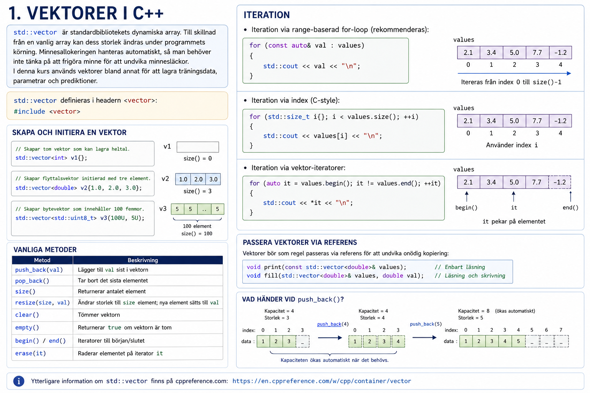
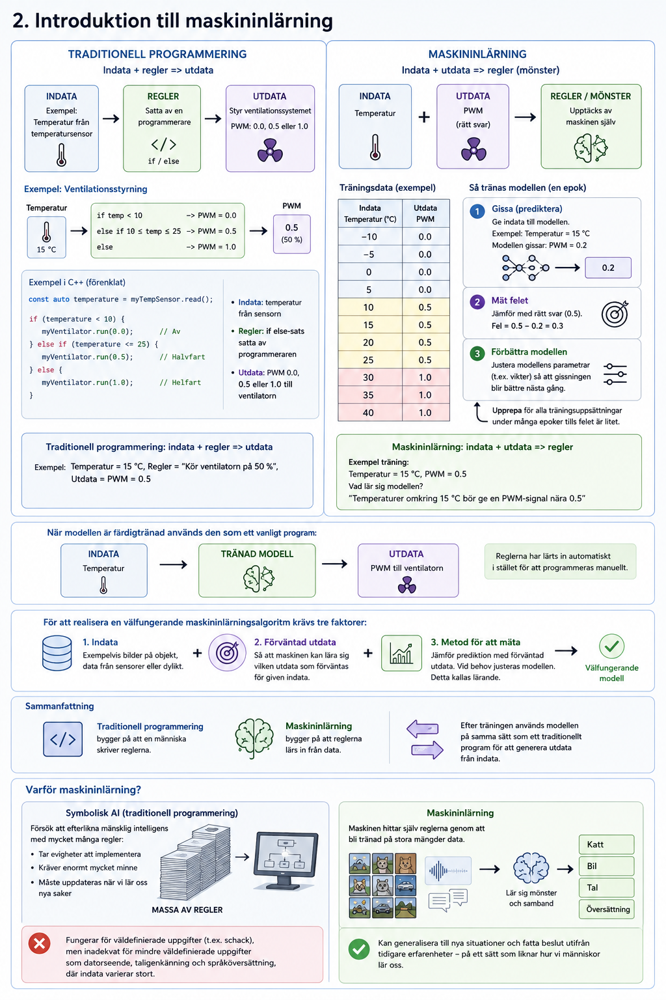

# Bilaga A - Bakgrund
Denna bilaga introducerar några grundläggande koncept som används senare i kursen. Först presenteras `std::vector`, som används för att lagra träningsdata och parametrar. Därefter följer en introduktion till maskininlärning och hur denna skiljer sig från traditionell programmering.

---

## 1. Vektorer i C++


`std::vector` definieras i headern `<vector>`:

```cpp
#include <vector>
```

---

### Skapa och initiera en vektor
Vektorer kan skapas enligt nedan:

```cpp
// Skapar tom vektor som kan lagra heltal.
std::vector<int> v1{};

// Skapar flyttalsvektor initierad med tre element.
std::vector<double> v2{1.0, 2.0, 3.0};

// Skapar bytevektor som innehåller 100 femmor.
std::vector<std::uint8_t> v3(100U, 5U);
```

---

### Vanliga metoder

| Metod | Beskrivning |
| :---- | :---------- |
| `push_back(val)` | Lägger till `val` sist i vektorn |
| `pop_back()` | Tar bort det sista elementet |
| `size()` | Returnerar antalet element |
| `resize(size, val)` | Ändrar storlek till `size` element; nya element sätts till `val` |
| `clear()` | Tömmer vektorn |
| `empty()` | Returnerar `true` om vektorn är tom |
| `begin()` / `end()` | Iteratorer till början/slutet |
| `erase(it)` | Raderar elementet på iterator `it` |

### Iteration
* Iteration via range-baserad for-loop (rekommenderas):

```cpp
for (const auto& val : values)
{         
    std::cout << val << "\n";
}
```

* Iteration via index (C-style):

```cpp
for (std::size_t i{}; i < values.size(); ++i) 
{
    std::cout << values[i] << "\n";
}
```

* Iteration via vektor-iteratorer:

```cpp
for (auto it = values.begin(); it != values.end(); ++it)
{
    std::cout << *it << "\n";
}
```

### Passera vektorer via referens
Vektorer bör som regel passeras via referens för att undvika onödig kopiering:

```cpp
void print(const std::vector<double>& values);      // Enbart läsning
void fill(std::vector<double>& values, double val); // Läsning och skrivning
```

Ytterligare information om `std::vector` finns på [cppreference.com](https://en.cppreference.com/w/cpp/container/vector).

---

## 2. Introduktion till maskininlärning



### Traditionell programmering
Som exempel på ett traditionellt program inom ett inbyggt system kan temperaturen läsas in som indata via en temperatursensor, där regler är implementerade via en villkorssats för att styra ett ventilationssystem utefter aktuell rumstemperatur. Nedan visas ett exempel på hur en metod för att implementera detta hade kunnat se ut i C++ för en metod `runVentilation()` i en fiktiv klass döpt `HardwareController`:

```cpp
/**
 * @brief Run the PWM controlled ventilation system. 
 */
void HardwareController::runVentilation() noexcept
{
    constexpr std::int8_t lowerTempLimit{10};
    constexpr std::int8_t upperTempLimit{25};

    constexpr double ventilatorOff{0.0};
    constexpr double ventilatorPwm{0.5};
    constexpr double ventilatorOn{1.0};

    // Read the room temperature with the tempsensor.
    const auto temperature = myTempSensor.read();

    // Disable the ventilator if the temperature is below 10 degrees Celsius.
    if (lowerTempLimit > temperature) 
    { 
        myVentilator.run(ventilatorOff);
    }
    // Run the ventilator at 50% if the temperature is between 10 and 25 degrees Celsius.
    else if ((lowerTempLimit <= temperature) && (upperTempLimit >= temperature)) 
    { 
        myVentilator.run(ventilatorPwm); 
    }
    // Run the ventilator at 100% if the temperature exceeds 25 degrees Celsius.
    else
    {
        myVentilator.run(ventilatorOn);
    }
}
```

---

### Maskininlärning
Gällande det tidigare exemplet med styrning av ett ventilationssystem hade vi kunnat skapa träningsuppsättningar i form av olika temperaturer som indata samt värden `0.0`, `0.5` samt `1.0` som utdata:

| Indata | Utdata |
|--------|--------|
|  -10   |  0.0   |
|  -5    |  0.0   |
|   0    |  0.0   |
|   5    |  0.0   |
|   10   |  0.5   |
|   15   |  0.5   |
|   20   |  0.5   |
|   25   |  0.5   |
|   30   |  1.0   |
|   35   |  1.0   |
|   40   |  1.0   |

---

### Varför maskininlärning?
Att efterlikna mänsklig intelligens med ett traditionellt program hade krävt en ofantlig mängd villkorssatser för att täcka alla tänkbara beslut och kombinationer av villkor, vilket i praktiken inte är görbart. Detta angreppssätt kallas *symbolisk AI* och var det dominerande paradigmet inom artificiell intelligens innan maskininlärning blev utbrett. Det fungerade väl för komplexa men väldefinierade uppgifter (t.ex. schack), men var inadekvat för mindre väldefinierade uppgifter som datorseende, taligenkänning och språköversättning, där indatan kan variera stort. Maskininlärning löser detta genom att låta maskinen själv hitta reglerna genom träning på stora mängder data, se figuren ovan för en jämförelse.

---
