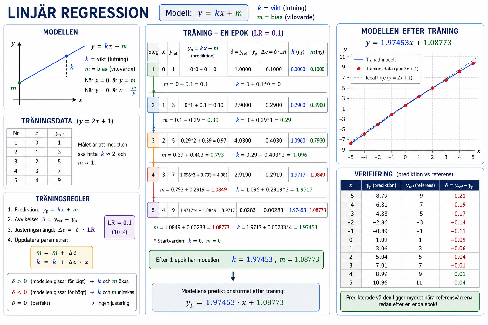

# Bilaga B - Linjär regression

## Introduktion
En av de vanligaste algoritmerna inom maskininlärning är linjär regression, som i praktiken innebär att maskinen tränas till att detektera ett linjärt mönster mellan indata x samt utdata y. Ur detta mönster kan en rät linje erhållas enligt nedanstående förstagradsekvation:

$$y = kx + m,$$

där k är linjens lutning och m är linjens vilovärde (värdet på utsignal y då insignal x är lika med noll).

---

### Vikt och bias
Inom maskininlärning används ofta begreppen **vikt** samt **biasvärde** i stället för k- och m-värde:
1. Insignal x sägs multipliceras med en vikt k.
2. Modellens biasvärde m utgör modellens vilovärde, vilket utgör utsignal y då insignal x är lika med noll.

Detta gäller särskilt för neurala nätverk, där en så kallad nod innehar ett biasvärde (m-värde) samt en eller flera vikter (k-värden). I praktiken är det dock samma; nodens insignaler x multipliceras med vikter k och summan k * x av dessa tillsammans med biasvärdet m utgör nodens utsignal y.

**OBS!** Noder i neurala nätverk är något mer komplicerade än så — utsignalen måste vanligtvis överstiga ett tröskelvärde för att noden ska aktiveras. Neurala nätverk behandlas senare i kursen.

---

### Träningsdata
För att träna modellen krävs träningsdata i form av indata x samt motsvarande utdata y. En uppsättning bestående av en insignal x samt en utsignal y utgör en **träningsuppsättning**. I tabellen nedan demonstreras ett exempel på fem träningsuppsättningar, där förhållandet mellan insignal x samt utsignal y kan beskrivas med formeln y = 2x + 1:

| x | y |
|:-:|:-:|
| 0 | 1 |
| 1 | 3 |
| 2 | 5 |
| 3 | 7 |
| 4 | 9 |

Träningsdatan bör inneha ett flertal olika träningsuppsättningar, alltså ett flertal uppsättningar av indata x samt utdata y. Vid träning kan samtliga träningsuppsättningar användas för att träna modellen flera omgångar, företrädesvis i slumpvis ordning för att modellen inte ska bli för bekant med träningsdatan. Antalet omgångar som träningsdatan används för att träna modellen kallas **epoker** eller *epochs*.

Vid träning bör sedan predikterad utdata $y_p$ jämföras mot motsvarande referensvärde från träningsdatan $y_{ref}$. Differensen mellan dessa utgör avvikelsen δ:

$$\delta = y_{ref} - y_p,$$

där δ är avvikelsen mellan referensvärde $y_{ref}$ samt predikterad utdata $y_p$.

Målet är att avvikelsen δ ska hamna så nära noll som möjligt, då modellen fungerar så bra som möjligt:

$$\delta = 0 \Rightarrow modellen\ fungerar\ utmärkt$$

Om avvikelsen δ är positiv, så är predikterat värde $y_p$ för lågt, vilket innebär att modellens k- och m-värde bör ökas:

$$\delta > 0 \Rightarrow k\ och\ m\ bör\ ökas$$

På samma sätt gäller att om avvikelsen δ är negativ, så är predikterat värde $y_p$ för högt, vilket innebär att modellens k- och m-värde bör minskas:

$$\delta < 0 \Rightarrow k\ och\ m\ bör\ minskas$$

Vid avvikelse bör modellens k- och m-värde justeras en viss justeringsmängd Δe, som utgör en faktor av avvikelsen δ enligt nedan:

$$\Delta e = \delta * LR,$$

där LR utgör lärhastigheten, även kallat *learning rate*, som bör justeras efter hur väl modellen fungerar. Ju högre lärhastighet, desto kraftigare justeras k- och m-värdet vid avvikelse. För hög lärhastighet kan dock medföra för stor justering per k- och m-värde. Som ett startvärde kan LR sättas till omkring 1 %, vilket motsvarar 0.01 vid beräkningarna. Detta värde bör sedan justeras tillsammans med antalet epoker (antalet träningsomgångar av aktuellt antal träningsuppsättningar).

Modellens m-värde bör ökas med justeringsmängden Δe:

$$m = m + \Delta e$$

Modellens k-värde bör ökas med justeringsmängden Δe multiplicerat med aktuell indata x. Därmed gäller att då x är lika med noll, då enbart m-värdet avgör utsignal y, så justeras inte k-värdet vid avvikelse, utan enbart m-värdet. Samtidigt gäller att ju högre x-värde, desto mer justeras k-värdet för given indata x:

$$k = k + \Delta e * x$$

---

### Träning av regressionsmodell för hand
En regressionsmodell ska tränas via de fem träningsuppsättningarna definierade enligt formeln y = 2x + 1:

| x | y |
|:-:|:-:|
| 0 | 1 |
| 1 | 3 |
| 2 | 5 |
| 3 | 7 |
| 4 | 9 |

Anta att modellens bias (m-värde) samt vikt (k-värde) är noll vid start:

$$\begin{cases} k = 0 \\ m = 0 \end{cases}$$

Genomför träning under en epok med en lärhastighet `LR` på 10 %:

$$LR = 0.1$$

Genomför sedan prediktion för indata bestående av alla heltal inom intervallet [-5, 5].

---

### Lösning
Nedanstående figur demonstrerar träningsförloppet:

Nedan redovisas samtliga uträkningar.

Vi genomför träning för varje träningsuppsättning en efter en.

#### Träningsuppsättning 1
Från den första träningsuppsättningen erhålls indata $x = 0$ samt referensvärde $y_{ref}$ = 1:

$$\begin{cases} x = 0 \\ y_{ref} = 1 \end{cases}$$

Eftersom modellens parametrar är lika med noll vid start blir predikterad utdata $y_p$ lika med noll:

$$y_p = k * x + m = 0 * 0 + 0 = 0$$

Avvikelsen $δ$ blir därmed lika med ett:

$$\delta = y_{ref} - y_p = 1 - 0 = 1$$

För en lärhastighet $LR$ på 10 % blir justeringsmängden $Δe$ lika med 0.1:

$$\Delta e = \delta * LR = 1 * 0.1 = 0.1$$

Modellens m-värde ökas direkt med justeringsmängden $Δe$:

$$m = m + \Delta e = 0 + 0.1 = 0.1$$

Modellens k-värde ökas med $Δe$ multiplicerat med x, vilket när $x = 0$ medför ingen förändring:

$$k = k + \Delta e * x = 0 + 0.1 * 0 = 0$$

Efter den första träningsrundan:

$$\begin{cases} k = 0 \\ m = 0.1 \end{cases}$$

#### Träningsuppsättning 2
$$\begin{cases} x = 1 \\ y_{ref} = 3 \end{cases}$$

$$y_p = k * x + m = 0 * 1 + 0.1 = 0.1$$

$$\delta = y_{ref} - y_p = 3 - 0.1 = 2.9$$

$$\Delta e = \delta * LR = 2.9 * 0.1 = 0.29$$

$$m = m + \Delta e = 0.1 + 0.29 = 0.39$$

$$k = k + \Delta e * x = 0 + 0.29 * 1 = 0.29$$

Efter den andra träningsrundan:

$$\begin{cases} k = 0.29 \\ m = 0.39 \end{cases}$$

#### Träningsuppsättning 3
$$\begin{cases} x = 2 \\ y_{ref} = 5 \end{cases}$$

$$y_p = k * x + m = 0.29 * 2 + 0.39 = 0.97$$

$$\delta = y_{ref} - y_p = 5 - 0.97 = 4.03$$

$$\Delta e = \delta * LR = 4.03 * 0.1 = 0.403$$

$$m = m + \Delta e = 0.39 + 0.403 = 0.793$$

$$k = k + \Delta e * x = 0.29 + 0.403 * 2 = 1.096$$

Efter den tredje träningsrundan:

$$\begin{cases} k = 1.096 \\ m = 0.793 \end{cases}$$

Notera att parametrarna börjar närma sig önskade värden (k = 2, m = 1).

#### Träningsuppsättning 4
$$\begin{cases} x = 3 \\ y_{ref} = 7 \end{cases}$$

$$y_p = k * x + m = 1.096 * 3 + 0.793 = 4.081$$

$$\delta = y_{ref} - y_p = 7 - 4.081 = 2.919$$

Notera att avvikelsen $δ$ nu för första gången har börjat minska.

$$\Delta e = \delta * LR = 2.919 * 0.1 = 0.2919$$

$$m = m + \Delta e = 0.793 + 0.2919 = 1.0849$$

$$k = k + \Delta e * x = 1.096 + 0.2919 * 3 = 1.9717$$

Efter den fjärde träningsrundan:

$$\begin{cases} k = 1.9717 \\ m = 1.0849 \end{cases}$$

Notera att parametrarna är mycket nära önskade värden (k = 2, m = 1).

#### Träningsuppsättning 5
$$\begin{cases} x = 4 \\ y_{ref} = 9 \end{cases}$$

$$y_p = k * x + m = 1.9717 * 4 + 1.0849 = 8.9717$$

$$\delta = y_{ref} - y_p = 9 - 8.9717 = 0.0283$$

$$\Delta e = \delta * LR = 0.0283 * 0.1 = 0.00283$$

$$m = m + \Delta e = 1.0849 + 0.00283 = 1.08773$$

$$k = k + \Delta e * x = 1.9717 + 0.00283 * 4 = 1.97453$$

Efter den femte träningsrundan:

$$\begin{cases} k = 1.97453 \\ m = 1.08773 \end{cases}$$

Notera att enbart efter en epok har regressionsmodellens parametrar hamnat mycket nära önskade värden (k = 2, m = 1). Normalt genomförs mycket fler epoker, exempelvis 1 000-10 000. Samtidigt brukar lärhastigheten ofta vara lägre, vilket medför mindre justering av parametrarna per epok.

Efter genomförd träning predikterar regressionsmodellen enligt följande formel:

$$y_p = 1.97453 * x + 1.08773$$

---

### Verifiering
I nedanstående tabell visas predikterad utdata $y_p$ samt referensvärden ($y_{ref}$) för indata $x$ i intervallet [-5, 5]. Predikterad utdata har avrundats till två decimaler.

| $x$ | $y_p$  | $y_{ref}$ |
|:--:|:------:|:---------:|
| -5 | -8.79  | -9        |
| -4 | -6.81  | -7        |
| -3 | -4.83  | -5        |
| -2 | -2.86  | -3        |
| -1 | -0.89  | -1        |
|  0 |  1.09  |  1        |
|  1 |  3.06  |  3        |
|  2 |  5.04  |  5        |
|  3 |  7.01  |  7        |
|  4 |  8.99  |  9        |
|  5 | 10.96  | 11        |

Notera att predikterad utdata $y_p$ i samtliga fall hamnar nära önskad utdata $y_{ref}$ efter genomförd träning under en enda epok!

---
