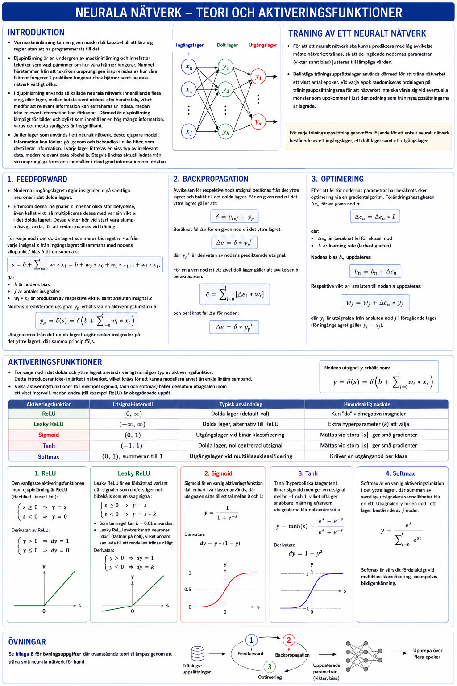

# Neurala nätverk

## Introduktion
* Via maskininlärning kan en given maskin bli kapabel till att lära sig regler utan att ha programmerats till det.
* **Djupinlärning** är en undergren av maskininlärning och innefattar tekniker som vagt påminner om hur våra hjärnor fungerar. Namnet härstammar från att tekniken ursprungligen inspirerades av hur våra hjärnor fungerar. I praktiken fungerar dock hjärnor samt neurala nätverk väldigt olika.
* I djupinlärning används så kallade **neurala nätverk** innehållande flera steg, eller lager, mellan indata samt utdata, ofta hundratals, vilket medför att relevant information kan extraheras ur indata, medan icke-relevant information kan förkastas. Därmed är djupinlärning lämpligt för bilder och dylikt som innehåller en hög mängd information, varav det mesta vanligtvis är insignifikant.
* Ju fler lager som används i ett neuralt nätverk, desto djupare modell. Information kan tänkas gå igenom och behandlas i olika filter, som destillerar information. I varje lager filtreras en viss typ av irrelevant data, medan relevant data bibehålls. Stegvis ändras aktuell indata från sin ursprungliga form och innehåller i ökad grad information om utdatan.

---

## Teori gällande träning av ett neuralt nätverk
* För att ett neuralt nätverk ska kunna prediktera med låg avvikelse måste nätverket tränas, så att de ingående nodernas parametrar (vikter samt bias) justeras till lämpliga värden.
* Befintliga träningsuppsättningar används därmed för att träna nätverket ett visst antal epoker. Vid varje epok randomiseras ordningen på träningsuppsättningarna för att nätverket inte ska vänja sig vid eventuella mönster som uppkommer i just den ordning som träningsuppsättningarna är lagrade.

För varje träningsuppsättning genomförs följande för ett enkelt neuralt nätverk bestående av ett ingångslager, ett dolt lager samt ett utgångslager.

### 1. Feedforward
* Noderna i ingångslagret utgör insignaler x på samtliga neuroner i det dolda lagret.
* Eftersom dessa insignaler x innehar olika stor betydelse, även kallat vikt, så multipliceras dessa med var sin vikt w i det dolda lagret. Dessa vikter bör vid start vara slumpmässigt valda, för att sedan justeras vid träning.

För varje nod i det dolda lagret summeras bidraget w * x från varje insignal x från ingångslagret tillsammans med nodens vilopunkt / bias b till en summa s:

$$s = b + \sum_{i=0}^{j} w_i * x_i = b + w_0 * x_0 + w_1 * x_1 \ldots + w_j * x_j,$$

där:
* $b$ är nodens bias
* $j$ är antalet insignaler
* $w_i * x_i$ är produkten av respektive vikt $w$ samt ansluten insignal $x$

Nodens predikterade utsignal $y_p$ erhålls via en aktiveringsfunktion δ:

$$y_p = \delta(s) = \delta\!\left(b + \sum_{i=0}^{j} w_i * x_i\right)$$

Utsignalerna från det dolda lagret utgör sedan insignaler på det yttre lagret, där samma princip följs.

### 2. Backpropagation
Avvikelsen för respektive nods utsignal beräknas från det yttre lagret och bakåt till det dolda lagret. För en given nod n i det yttre lagret gäller att:

$$\delta = y_{ref} - y_p$$

Beräknat fel Δe för en given nod n i det yttre lagret:

$$\Delta e = \delta * y_p'$$

där $y_p'$ är derivatan av nodens predikterade utsignal.

För en given nod n i ett givet dolt lager gäller att avvikelsen δ beräknas som:

$$\delta = \sum_{i=0}^{j} [\Delta e_i * w_i]$$

och beräknat fel Δe för noden:

$$\Delta e = \delta * y_p'$$

### 3. Optimering
Efter att fel för nodernas parametrar har beräknats sker optimering via en gradientalgoritm. Förändringshastigheten Δc_n för en given nod n:

$$\Delta c_n = \Delta e_n * L$$

där:
* $\Delta e_n$ är beräknat fel för aktuell nod
* $L$ är learning rate (lärhastigheten)

Nodens bias $b_n$ uppdateras:

$$b_n = b_n + \Delta c_n$$

Respektive vikt $w_j$ ansluten till noden n uppdateras:

$$w_j = w_j + \Delta c_n * y_j$$

där $y_j$ är utsignalen från ansluten nod j i föregående lager (för ingångslagret gäller $y_j = x_j$).

---

## Aktiveringsfunktioner
* För varje nod i det dolda och yttre lagret används vanligtvis någon typ av aktiveringsfunktion. Detta introducerar icke-linjäritet i nätverket, vilket krävs för att kunna modellera annat än enkla linjära samband.
* Vissa aktiveringsfunktioner (till exempel sigmoid, tanh och softmax) håller dessutom utsignalen inom ett visst intervall, medan andra (till exempel ReLU) är obegränsade uppåt.

| Aktiveringsfunktion | Utsignal-intervall | Typisk användning | Huvudsaklig nackdel |
|---|---|---|---|
| ReLU | $[0, \infty)$ | Dolda lager (default-val) | Kan "dö" vid negativa insignaler |
| Leaky ReLU | $(-\infty, \infty)$ | Dolda lager, alternativ till ReLU | Extra hyperparameter (k) att välja |
| Sigmoid | $(0, 1)$ | Utgångslager vid binär klassificering | Mättas vid stora \|s\|, ger små gradienter |
| Tanh | $(-1, 1)$ | Dolda lager, nollcentrerad utsignal | Mättas vid stora \|s\|, ger små gradienter |
| Softmax | $(0, 1)$, summerar till 1 | Utgångslager vid multiklassklassificering | Kräver en utgångsnod per klass |

Nodens utsignal y erhålls som:

$$y = \delta(s) = \delta\!\left(b + \sum_{i=0}^{j} w_i * x_i\right)$$

### 1. ReLU
Den vanligaste aktiveringsfunktionen inom djupinlärning är **ReLU** *(Rectified Linear Unit)*:

$$\begin{cases} s \geq 0 \Rightarrow y = s \\ s < 0 \Rightarrow y = 0 \end{cases}$$

Som regel brukar ReLU utgöra den lämpligaste aktiveringsfunktionen att implementera när det inte finns något entydigt svar.

**Leaky ReLU** är en förbättrad variant där signaler som understiger noll bibehålles som en svag signal:

$$\begin{cases} s \geq 0 \Rightarrow y = s \\ s < 0 \Rightarrow y = s * k \end{cases}$$

* Som tumregel kan k = 0,01 användas.
* Leaky ReLU motverkar att neuroner "dör" (fastnar på noll), vilket annars kan leda till att modellen tränas dåligt.

Derivatan av ReLU:

$$\begin{cases} y > 0 \Rightarrow dy = 1 \\ y \leq 0 \Rightarrow dy = 0 \end{cases}$$

### 2. Sigmoid
Sigmoid är en vanlig aktiveringsfunktion ifall enbart två klasser används, där utsignalen sätts till ett tal mellan 0 och 1:

$$y = \frac{1}{1 + e^{-s}}$$

Derivatan:

$$dy = y * (1 - y)$$

### 3. Tanh
Tanh *(hyperboliska tangenten)* liknar sigmoid men ger en utsignal mellan -1 och 1, vilket ofta ger snabbare inlärning eftersom utsignalerna blir nollcentrerade:

$$y = \tanh(s) = \frac{e^s - e^{-s}}{e^s + e^{-s}}$$

Derivatan:

$$dy = 1 - y^2$$

### 4. Softmax
Softmax är en vanlig aktiveringsfunktion i det yttre lagret, där summan av samtliga utsignalers sannolikheter blir ett. Utsignalen y för en nod i ett lager bestående av j noder:

$$y = \frac{e^s}{\sum_{i=0}^{j} e^{s_i}}$$

Softmax är särskilt fördelaktigt vid multiklassklassificering, exempelvis bildigenkänning.

---

## Övningar
Se [bilaga B](./b_exercises.md) för övningsuppgifter där ovanstående teori tillämpas genom att träna små neurala nätverk för hand.

---
