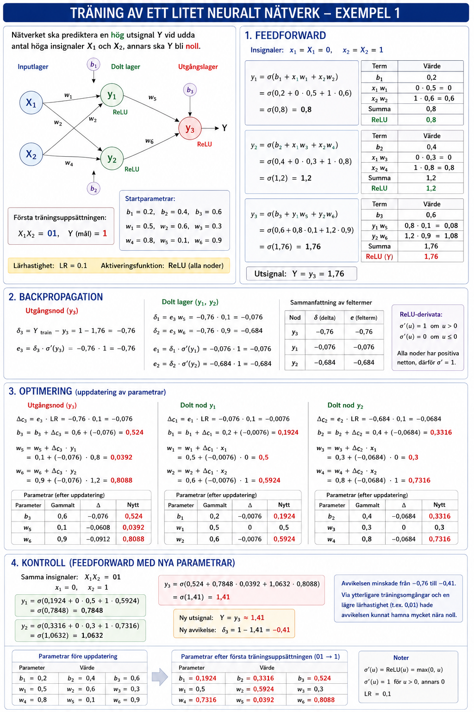
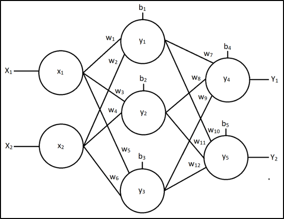
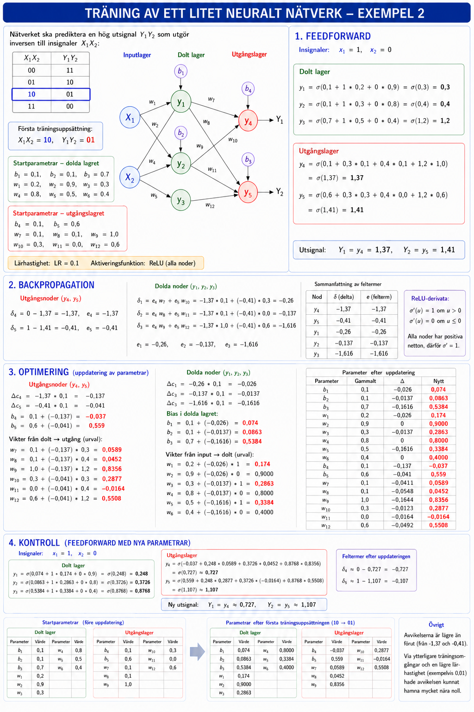
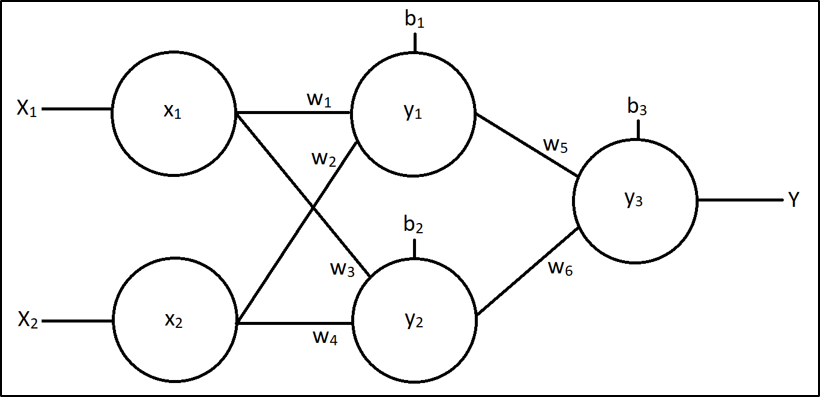
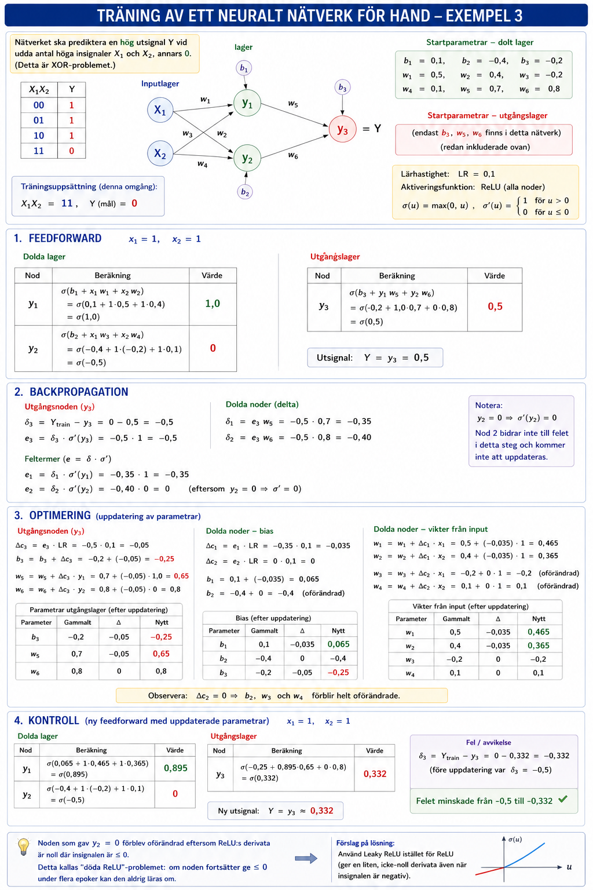

# Övningsuppgifter

## Träning av ett neuralt nätverk för hand – Exempel 1
Det neurala nätverket nedan ska tränas till att kunna prediktera en hög utsignal Y vid udda antal höga insignaler X1 och X2, annars ska utsignal Y bli noll:


Den första träningsuppsättningen: insignaler X1X2 = 01, Y = 1.

**Startparametrar:**

```
b1 = 0.2,  b2 = 0.4,  b3 = 0.6
w1 = 0.5,  w2 = 0.6,  w3 = 0.3
w4 = 0.8,  w5 = 0.1,  w6 = 0.9
```

Lärhastighet: LR = 0.1. Aktiveringsfunktion: ReLU för alla noder.

### Lösning – Exempel 1
Nedanstående figur demonstrerar träningsförloppet:



Nedan redovisas samtliga beräkningar.

#### 1. Feedforward

$$x_1 = X_1 = 0, \quad x_2 = X_2 = 1$$

$$y_1 = \sigma(b_1 + x_1 w_1 + x_2 w_2) = \sigma(0{,}2 + 0 * 0{,}5 + 1 * 0{,}6) = \sigma(0{,}8) = 0{,}8$$

$$y_2 = \sigma(b_2 + x_1 w_3 + x_2 w_4) = \sigma(0{,}4 + 0 * 0{,}3 + 1 * 0{,}8) = \sigma(1{,}2) = 1{,}2$$

$$y_3 = \sigma(b_3 + y_1 w_5 + y_2 w_6) = \sigma(0{,}6 + 0{,}8 * 0{,}1 + 1{,}2 * 0{,}9) = \sigma(1{,}76) = 1{,}76$$

$$Y = y_3 = 1{,}76$$

#### 2. Backpropagation

$$\delta_3 = Y_{train} - y_3 = 1 - 1{,}76 = -0{,}76$$

$$e_3 = \delta_3 * \sigma'(y_3) = -0{,}76 * 1 = -0{,}76$$

$$\delta_1 = e_3 w_5 = -0{,}76 * 0{,}1 = -0{,}076$$

$$\delta_2 = e_3 w_6 = -0{,}76 * 0{,}9 = -0{,}684$$

$$e_1 = \delta_1 * \sigma'(y_1) = -0{,}076 * 1 = -0{,}076$$

$$e_2 = \delta_2 * \sigma'(y_2) = -0{,}684 * 1 = -0{,}684$$

#### 3. Optimering

$$\Delta c_3 = e_3 * LR = -0{,}76 * 0{,}1 = -0{,}076$$

$$b_3 = b_3 + \Delta c_3 = 0{,}6 + (-0{,}076) = 0{,}524$$

$$w_5 = w_5 + \Delta c_3 * y_1 = 0{,}1 + (-0{,}076) * 0{,}8 = 0{,}0392$$

$$w_6 = w_6 + \Delta c_3 * y_2 = 0{,}9 + (-0{,}076) * 1{,}2 = 0{,}8088$$

$$\Delta c_1 = e_1 * LR = -0{,}076 * 0{,}1 = -0{,}0076$$

$$\Delta c_2 = e_2 * LR = -0{,}684 * 0{,}1 = -0{,}0684$$

$$b_1 = 0{,}2 + (-0{,}0076) = 0{,}1924, \quad w_1 = 0{,}5 + (-0{,}0076) * 0 = 0{,}5, \quad w_2 = 0{,}6 + (-0{,}0076) * 1 = 0{,}5924$$

$$b_2 = 0{,}4 + (-0{,}0684) = 0{,}3316, \quad w_3 = 0{,}3 + (-0{,}0684) * 0 = 0{,}3, \quad w_4 = 0{,}8 + (-0{,}0684) * 1 = 0{,}7316$$

#### 4. Kontroll (via feedforward)

Med nya parametrar och samma insignaler X1X2 = 01:

$$y_1 = \sigma(0{,}1924 + 0 * 0{,}5 + 1 * 0{,}5924) = \sigma(0{,}7848) = 0{,}7848$$

$$y_2 = \sigma(0{,}3316 + 0 * 0{,}3 + 1 * 0{,}7316) = \sigma(1{,}0632) = 1{,}0632$$

$$y_3 = \sigma(0{,}524 + 0{,}7848 * 0{,}0392 + 1{,}0632 * 0{,}8088) = \sigma(1{,}41) = 1{,}41$$

$$Y = y_3 \approx 1{,}41, \quad \delta_3 = 1 - 1{,}41 = -0{,}41$$

Avvikelsen minskade från -0,76 till -0,41. Via ytterligare träningsomgångar och en lägre lärhastighet (exempelvis 0,01) hade avvikelsen kunnat hamna mycket nära noll.

---

## Träning av ett neuralt nätverk för hand – Exempel 2
Betrakta det neurala nätverket nedan:



Nätverket ska tränas till att prediktera utsignaler Y1Y2 som utgör inversen till insignaler X1X2:

| X1X2 | Y1Y2 |
|:----:|:----:|
|  00  |  11  |
|  01  |  10  |
|  10  |  01  |
|  11  |  00  |

Första träningsuppsättning: X1X2 = 10, Y1Y2 = 01.

**Startparametrar – dolda lagret:**

```
b1 = 0.1,  b2 = 0.1,  b3 = 0.7
w1 = 0.2,  w2 = 0.9,  w3 = 0.3
w4 = 0.8,  w5 = 0.5,  w6 = 0.4
```

**Startparametrar – utgångslagret:**

```
b4 = 0.1,  b5 = 0.6
w7  = 0.1,  w8  = 0.1,  w9  = 1.0
w10 = 0.3,  w11 = 0.0,  w12 = 0.6
```

Lärhastighet: LR = 0.1. Aktiveringsfunktion: ReLU för alla noder.

### Lösning – Exempel 2
Nedanstående figur demonstrerar träningsförloppet:



Nedan redovisas samtliga beräkningar.


#### 1. Feedforward

$$x_1 = 1, \quad x_2 = 0$$

$$y_1 = \sigma(0{,}1 + 1 * 0{,}2 + 0 * 0{,}9) = 0{,}3$$

$$y_2 = \sigma(0{,}1 + 1 * 0{,}3 + 0 * 0{,}8) = 0{,}4$$

$$y_3 = \sigma(0{,}7 + 1 * 0{,}5 + 0 * 0{,}4) = 1{,}2$$

$$y_4 = \sigma(0{,}1 + 0{,}3 * 0{,}1 + 0{,}4 * 0{,}1 + 1{,}2 * 1{,}0) = \sigma(1{,}37) = 1{,}37$$

$$y_5 = \sigma(0{,}6 + 0{,}3 * 0{,}3 + 0{,}4 * 0{,}0 + 1{,}2 * 0{,}6) = \sigma(1{,}41) = 1{,}41$$

$$Y_1 = y_4 = 1{,}37, \quad Y_2 = y_5 = 1{,}41$$

#### 2. Backpropagation

$$\delta_4 = 0 - 1{,}37 = -1{,}37, \quad e_4 = -1{,}37$$

$$\delta_5 = 1 - 1{,}41 = -0{,}41, \quad e_5 = -0{,}41$$

$$\delta_1 = e_4 w_7 + e_5 w_{10} = -1{,}37 * 0{,}1 + (-0{,}41) * 0{,}3 = -0{,}26$$

$$\delta_2 = e_4 w_8 + e_5 w_{11} = -1{,}37 * 0{,}1 + (-0{,}41) * 0{,}0 = -0{,}137$$

$$\delta_3 = e_4 w_9 + e_5 w_{12} = -1{,}37 * 1{,}0 + (-0{,}41) * 0{,}6 = -1{,}616$$

$$e_1 = -0{,}26, \quad e_2 = -0{,}137, \quad e_3 = -1{,}616$$

#### 3. Optimering

$$\Delta c_4 = -1{,}37 * 0{,}1 = -0{,}137, \quad \Delta c_5 = -0{,}41 * 0{,}1 = -0{,}041$$

$$b_4 = 0{,}1 + (-0{,}137) = -0{,}037, \quad b_5 = 0{,}6 + (-0{,}041) = 0{,}559$$

Vikter i utgångslagret (urval):

$$w_7 = 0{,}1 + (-0{,}137) * 0{,}3 = 0{,}0589, \quad w_9 = 1{,}0 + (-0{,}137) * 1{,}2 = 0{,}8356$$

$$\Delta c_1 = -0{,}026, \quad \Delta c_2 = -0{,}0137, \quad \Delta c_3 = -0{,}1616$$

Bias i dolda lagret:

$$b_1 = 0{,}074, \quad b_2 = 0{,}0863, \quad b_3 = 0{,}5384$$

Vikter i dolda lagret (urval):

$$w_1 = 0{,}174, \quad w_3 = 0{,}2863, \quad w_5 = 0{,}3384$$

#### 4. Kontroll (via feedforward)

Med nya parametrar och X1X2 = 10:

$$y_1 \approx 0{,}248, \quad y_2 \approx 0{,}3726, \quad y_3 \approx 0{,}8768$$

$$Y_1 = y_4 \approx 0{,}727, \quad Y_2 = y_5 \approx 1{,}107$$

$$\delta_4 \approx 0 - 0{,}727 = -0{,}727, \quad \delta_5 \approx 1 - 1{,}107 = -0{,}107$$

Avvikelserna är lägre än förut (från -1,37 och -0,41). Via ytterligare träningsomgångar och en lägre lärhastighet (exempelvis 0,01) hade avvikelsen kunnat hamna mycket nära noll.

---

## Träning av ett neuralt nätverk för hand – Exempel 3
Betrakta det neurala nätverket nedan:



Nätverket ska tränas till att kunna prediktera en hög utsignal Y vid udda antal höga insignaler X1 och X2, annars ska utsignal Y bli noll.

Träning har genomförts via en epok tidigare och parametrarna har vid start följande värden:

**Startparametrar:**

```
b1 = 0.1,   b2 = -0.4,  b3 = -0.2
w1 = 0.5,   w2 = 0.4,   w3 = -0.2
w4 = 0.1,   w5 = 0.7,   w6 = 0.8
```

Träning ska nu genomföras med träningsuppsättningen X1X2 = 11, Y = 0.

Lärhastighet: LR = 0.1. Aktiveringsfunktion: ReLU för alla noder.

Genomför feedforward, backpropagation samt optimering. Beräkna sedan utsignalen igen. Blev felet mindre? Om inte, vad hade du kunnat ändra för att erhålla mindre fel?

### Lösning – Exempel 3
Nedanstående figur demonstrerar träningsförloppet:



Nedan redovisas samtliga beräkningar.

#### 1. Feedforward

$$x_1 = X_1 = 1, \quad x_2 = X_2 = 1$$

$$y_1 = \sigma(b_1 + x_1 w_1 + x_2 w_2) = \sigma(0{,}1 + 1 * 0{,}5 + 1 * 0{,}4) = \sigma(1{,}0) = 1{,}0$$

$$y_2 = \sigma(b_2 + x_1 w_3 + x_2 w_4) = \sigma(-0{,}4 + 1 * (-0{,}2) + 1 * 0{,}1) = \sigma(-0{,}5) = 0$$

$$y_3 = \sigma(b_3 + y_1 w_5 + y_2 w_6) = \sigma(-0{,}2 + 1{,}0 * 0{,}7 + 0 * 0{,}8) = \sigma(0{,}5) = 0{,}5$$

$$Y = y_3 = 0{,}5$$

#### 2. Backpropagation

$$\delta_3 = Y_{train} - y_3 = 0 - 0{,}5 = -0{,}5$$

$$e_3 = \delta_3 * \sigma'(y_3) = -0{,}5 * 1 = -0{,}5$$

$$\delta_1 = e_3 w_5 = -0{,}5 * 0{,}7 = -0{,}35$$

$$\delta_2 = e_3 w_6 = -0{,}5 * 0{,}8 = -0{,}4$$

$$e_1 = \delta_1 * \sigma'(y_1) = -0{,}35 * 1 = -0{,}35$$

$$e_2 = \delta_2 * \sigma'(y_2) = -0{,}4 * 0 = 0$$

Notera att $y_2 = 0$, vilket medför att $\sigma'(y_2) = 0$ eftersom ReLU:s derivata är noll för insignaler $\leq 0$. Nod 2 bidrar därmed inte till felet och kommer inte att uppdateras i detta steg.

#### 3. Optimering

$$\Delta c_3 = e_3 * LR = -0{,}5 * 0{,}1 = -0{,}05$$

$$b_3 = b_3 + \Delta c_3 = -0{,}2 + (-0{,}05) = -0{,}25$$

$$w_5 = w_5 + \Delta c_3 * y_1 = 0{,}7 + (-0{,}05) * 1{,}0 = 0{,}65$$

$$w_6 = w_6 + \Delta c_3 * y_2 = 0{,}8 + (-0{,}05) * 0 = 0{,}8$$

$$\Delta c_1 = e_1 * LR = -0{,}35 * 0{,}1 = -0{,}035$$

$$\Delta c_2 = e_2 * LR = 0 * 0{,}1 = 0$$

$$b_1 = 0{,}1 + (-0{,}035) = 0{,}065, \quad w_1 = 0{,}5 + (-0{,}035) * 1 = 0{,}465, \quad w_2 = 0{,}4 + (-0{,}035) * 1 = 0{,}365$$

$$b_2 = -0{,}4 + 0 = -0{,}4, \quad w_3 = -0{,}2 + 0 * 1 = -0{,}2, \quad w_4 = 0{,}1 + 0 * 1 = 0{,}1$$

Eftersom $\Delta c_2 = 0$ förblir $b_2$, $w_3$ och $w_4$ helt oförändrade.

#### 4. Kontroll (via feedforward)

Med nya parametrar och samma insignaler X1X2 = 11:

$$y_1 = \sigma(0{,}065 + 1 * 0{,}465 + 1 * 0{,}365) = \sigma(0{,}895) = 0{,}895$$

$$y_2 = \sigma(-0{,}4 + 1 * (-0{,}2) + 1 * 0{,}1) = \sigma(-0{,}5) = 0$$

$$y_3 = \sigma(-0{,}25 + 0{,}895 * 0{,}65 + 0 * 0{,}8) = \sigma(0{,}332) = 0{,}332$$

$$Y = y_3 \approx 0{,}332, \quad \delta_3 = 0 - 0{,}332 = -0{,}332$$

Avvikelsen minskade från -0,5 till -0,332, så felet blev mindre. Noden som gav $y_2 = 0$ förblev dock helt oförändrad eftersom ReLU:s derivata är noll där insignalen är $\leq 0$ – ett exempel på det så kallade "döda ReLU"-problemet. Om detta hade fortsatt att inträffa under flera på varandra följande epoker hade den noden aldrig kunnat läras om. För att motverka detta hade **Leaky ReLU** kunnat användas istället för ReLU, eftersom den tillåter en svag signal (och därmed en icke-noll derivata) även när insignalen är negativ.

---
