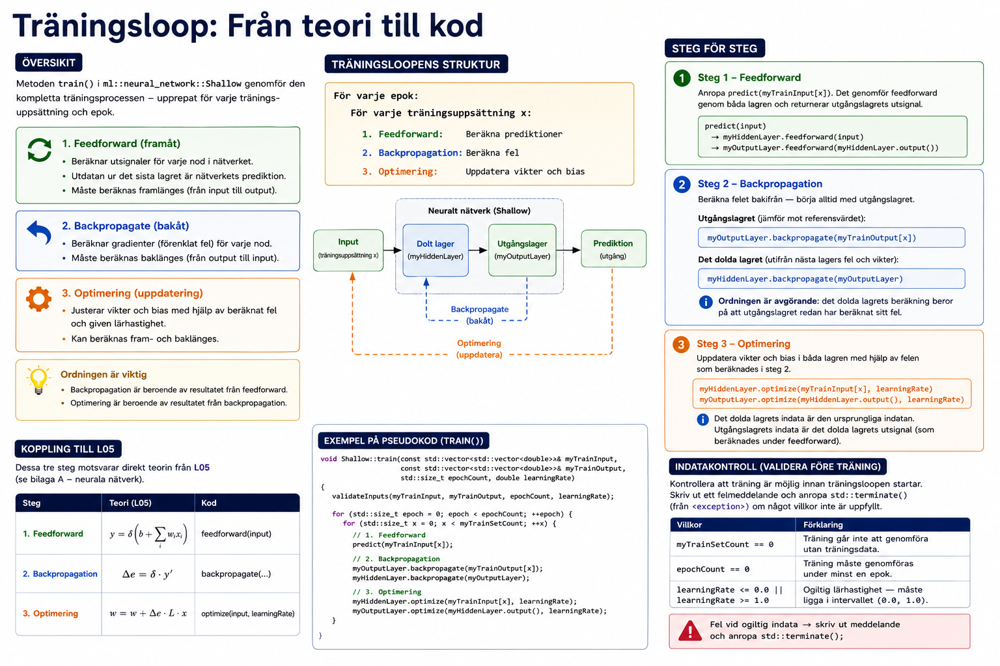

# Träningsloop: Från teori till kod

## Översikt
Ni ska implementera metoden `train()` i `ml::neural_network::Shallow`. Metoden genomför den 
kompletta träningsprocessen, upprepat för varje träningsuppsättning och epok:
* Feedforward: 
  * Beräknar utsignaler för varje nod i nätverket
  * Utdatan ur det sista lagret utgör nätverkets prediktion.
  * Måste beräknas framlänges (från input till output).
* Backpropagate: 
  * Beräknar gradienter (förenklat fel) för varje nod i nätverket.
  * Måste beräknas baklänges (från output till input).
* Optimering: 
  * Justerar de träningsbara parametrarna (vikter och bias) utefter beräknat fel, tillsammans med given lärhastighet.
  * Beräkning kan ske både fram- och baklänges.

---

## Träningsloopens struktur



Träningsloopen kan summeras enligt nedan:

```
För varje epok:
    För varje träningsuppsättning x:
        1. Feedforward: Beräkna prediktioner
        2. Backpropagation: Beräkna fel
        3. Optimering: Uppdatera vikter och bias
```

Ordningen är viktig:
* Backpropagation är beroende av resultatet från feedforward.
* Optimering är beroende av resultatet från backpropagation.

---

## Steg 1 – Feedforward
Anropa `predict(myTrainInput[x])`. Det genomför feedforward genom båda lagren och returnerar utgångslagrets utsignal.

```
predict(input)
  → myHiddenLayer.feedforward(input)
  → myOutputLayer.feedforward(myHiddenLayer.output())
```

---

## Steg 2 – Backpropagation
Beräkna felet bakifrån — börja alltid med utgångslagret.

**Utgångslagret** jämför sin utsignal mot referensvärdet:
```
myOutputLayer.backpropagate(myTrainOutput[x])
```

**Det dolda lagret** beräknar sitt fel utifrån utgångslagrets fel och vikter:
```
myHiddenLayer.backpropagate(myOutputLayer)
```

Ordningen är avgörande: det dolda lagrets beräkning beror på att utgångslagret redan har beräknat sitt fel.

---

## Steg 3 – Optimering
Uppdatera vikter och bias i båda lagren med hjälp av felen som beräknades i steg 2.

```
myHiddenLayer.optimize(myTrainInput[x], learningRate)
myOutputLayer.optimize(myHiddenLayer.output(), learningRate)
```

Det dolda lagrets indata är den ursprungliga indatan. Utgångslagrets indata är det dolda lagrets utsignal (den som beräknades under feedforward).

---

## Koppling till L05
Dessa tre steg motsvarar direkt teorin från **L05** (se [bilaga A](../../L05/appendix/a_neural_networks.md)):

| Steg | Teori (L05) | Kod |
|---|---|---|
| Feedforward | $y = \delta(b + \sum w_i x_i)$ | `feedforward(input)` |
| Backpropagation | $\Delta e = \delta \cdot y'$ | `backpropagate(...)` |
| Optimering | $w = w + \Delta e \cdot L \cdot x$ | `optimize(input, learningRate)` |

---

## Indatakontroll
Kontrollera att träning är möjlig innan träningsloopen startar. Skriv ut ett felmeddelande och anropa `std::terminate()` (från `<exception>`) direkt om något av följande villkor är uppfyllt:

| Villkor | Förklaring |
|---|---|
| `myTrainSetCount == 0` | Träning går inte att genomföra utan träningsdata. |
| `epochCount == 0` | Träning måste genomföras under minst en epok. |
| `learningRate <= 0.0 \|\| learningRate >= 1.0` | Ogiltig lärhastighet — måste ligga i intervallet `(0.0, 1.0)`. |

---
