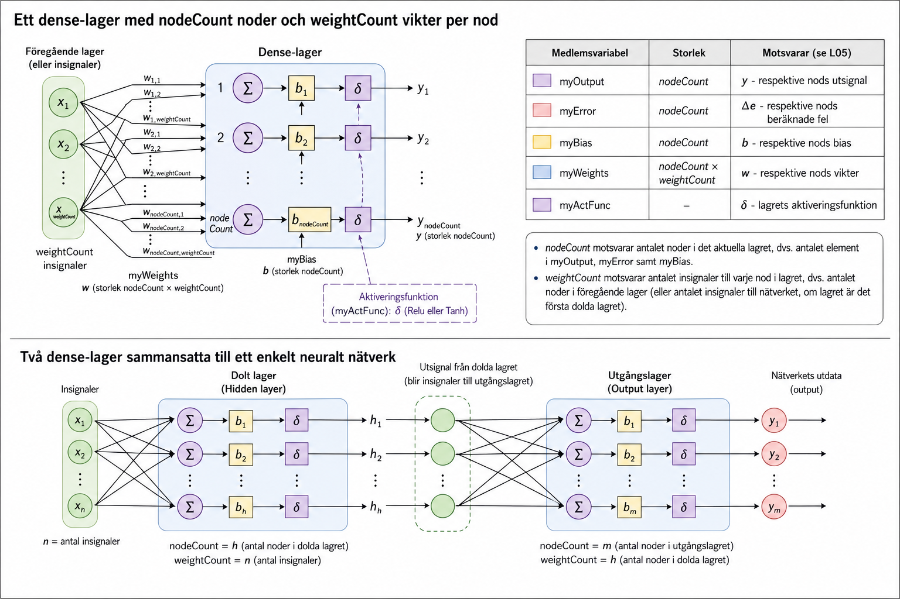

# Dense-lager - Arkitektur

## Introduktion
* Ett **dense-lager** *(fully connected layer)* är ett lager i ett neuralt nätverk där varje nod tar emot samtliga insignaler från föregående lager.
* Klassen `ml::dense_layer::Dense` (se [bilaga B](./b_exercises.md)) implementerar interfacet `ml::dense_layer::Interface` och representerar ett sådant lager, oavsett om det används som dolt lager eller utgångslager i nätverket.

---

## Uppbyggnad av ett lager
Ett dense-lager med `nodeCount` noder och `weightCount` vikter per nod består av de delar som beskrivs nedan. Dessa motsvarar direkt teorin i **L05** (se [bilaga A](../../L05/appendix/a_neural_networks.md)):

| Medlemsvariabel | Storlek | Motsvarar (se L05) |
|---|---|---|
| `myOutput` | `nodeCount` | $y$ - respektive nods utsignal |
| `myError` | `nodeCount` | $\Delta e$ - respektive nods beräknade fel |
| `myBias` | `nodeCount` | $b$ - respektive nods bias |
| `myWeights` | `nodeCount` x `weightCount` | $w$ - respektive nods vikter |
| `myActFunc` | – | $\delta$ - lagrets aktiveringsfunktion |

* `nodeCount` motsvarar antalet noder i det aktuella lagret, dvs. antalet element i `myOutput`, `myError` samt `myBias`.
* `weightCount` motsvarar antalet insignaler till varje nod i lagret, dvs. antalet noder i föregående lager (eller antalet insignaler till nätverket, om lagret är det första dolda lagret).

---

## Aktiveringsfunktion
Varje lager tilldelas en aktiveringsfunktion av typen `ActFunc` vid konstruktion:
* `ActFunc::Relu` - motsvarar ReLU, se **L05**.
* `ActFunc::Tanh` - motsvarar tanh, se **L05**.

Aktiveringsfunktionen tillämpas på samtliga noder i lagret vid feedforward (implementeras i **L09**).

---

## Sammansättning till ett neuralt nätverk
* Ett enkelt neuralt nätverk (`ml::neural_network::Shallow`, se **L06-L07**) består av två dense-lager: ett dolt lager samt ett utgångslager.
* Utsignalen (`output()`) från det dolda lagret utgör insignalen till utgångslagret, vilket motsvarar principen som beskrivs i **L05** (se bilden i inledningen ovan).

---
