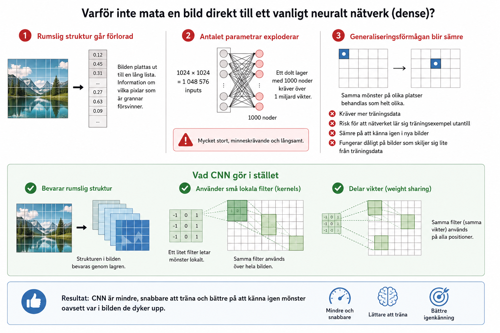

# Bilaga A - Varför inte mata en bild direkt till ett vanligt neuralt nätverk?

Ett vanligt neuralt nätverk (bestående enbart av dense-lager) går rent tekniskt att använda för att bearbeta bilder, men i praktiken fungerar det sällan bra. Nedan går vi igenom varför, och vad konvolutionella neurala nätverk (CNN) gör annorlunda.

---

### Rumslig struktur går förlorad
En bild är två- eller tredimensionell, men måste plattas ut till en endimensionell vektor för att matas in i ett vanligt neuralt nätverk, vilket gör att informationen om vilka pixlar som satt bredvid varandra försvinner.

---

### Antalet parametrar exploderar
En bild på 1024 × 1024 pixlar kräver över en miljard vikter redan i ett enda dolt lager med 1000 noder, vilket ger ett nätverk som är stort, minneskrävande och långsamt.

---

### Generaliseringen blir sämre
Eftersom varje pixel behandlas som en helt egen input förstår nätverket inte att samma mönster kan dyka upp på olika ställen i bilden, vilket kräver mer träningsdata och ger sämre generalisering till nya bilder.

---

### Vad CNN gör i stället
Konvolutionella neurala nätverk är byggda specifikt för bilddata och löser detta genom att bevara bildens rumsliga struktur, använda små lokala filter (kernels) samt dela samma vikter över hela bilden.

---
