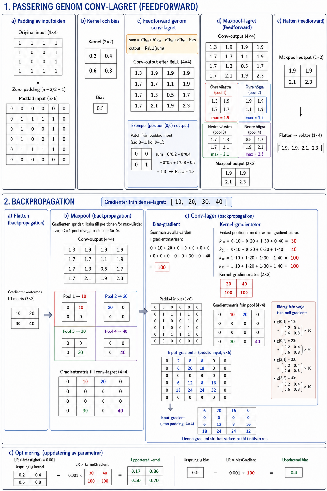

# Bilaga A - Träning av ett litet konvolutionellt neuralt nätverk

Vi har följande konvolutionella neurala nätverk:
* Input: **4×4**
* Conv-lager:
  * Kernel: **2×2**
  * Stride = 1 *(kerneln flyttas ett pixelsteg i taget)*
  * Zero-padding *(vi lägger till nollor runt bilden så att bildstorleken behålls trots extraktionen)*
  * Aktivering: **ReLU** *(alla negativa värden ersätts med noll)*
  * Lärhastighet: **LR** = 0.001, dvs. 1 %.
* Maxpool:
  * Poolstorlek = 2
  * Stride = 2 *(poolerna är icke-överlappande)*
* Flatten:
  * 2×2 → 1×4

---

Nedanstående figur demonstrerar träningsförloppet:



Nedan redovisas samtliga beräkningar.

### 1. Passering genom conv-lagret

#### a) Padding av inputbilden
Anta att vi har följande inputbild, som efterliknar siffran 0 i form av ettor:

```
1 1 1 1
1 0 0 1
1 0 0 1
1 1 1 1
```

Det första steget är att använda *zero-padding*: vi lägger till nollor runt bilden så att dess storlek behålls även efter att kernel-filtret applicerats. På så sätt får conv-lagrets utdata samma dimensioner som indatan, i det här fallet **4×4**.

Antalet nollor `n` vi lägger till åt respektive håll beräknas som:

```
n = kernel_size / 2
```

där `kernel_size` är kernelns storlek, `2` i detta exempel, alltså en nolla på varje sida. Den paddade bilden blir då **6×6**:

```
0 0 0 0 0 0
0 1 1 1 1 0
0 1 0 0 1 0
0 1 0 0 1 0
0 1 1 1 1 0
0 0 0 0 0 0
```

---

#### b) Kernel och bias
Vi använder en kernel (ett filter med vikter) och en bias. Här har vi valt enkla, fasta värden för att göra beräkningarna lätta att följa:

**Kernel-vikter:**

```
0.2 0.4
0.6 0.8
```

**Bias:**

```
0.5
```

---

#### c) Feedforward genom conv-lagret
För varje position i bilden beräknas summan av elementvis multiplikation mellan kernel och motsvarande del av bilden, plus bias. Därefter appliceras ReLU-aktivering (alla negativa värden ersätts med noll):

```
sum = a * k00 + b * k01 + c * k10 + d * k11 + bias
output = ReLU(sum)
```

där:
* **a, b, c, d** är pixelvärden från den aktuella 2×2-delen av bilden.
* **k** står för kernel (filtret), t.ex. betyder `k00` värdet på rad 0, kolumn 0 i kernel-matrisen, alltså övre vänstra hörnet.
* **bias** är ett konstant värde som läggs till summan.

När vi applicerat kernel och bias på hela bilden får vi följande conv-output (4×4):

```
1.3 1.9 1.9 1.9
1.7 1.7 1.1 1.9
1.7 1.3 0.5 1.7
1.7 2.1 1.9 2.3
```

---

#### d) Maxpool-lagret (feedforward)
Maxpool-lagret söker efter det största värdet i varje 2×2-pool (icke-överlappande) från conv-lagrets utdata. Syftet är att sampla ned bilden: vi tar bort detaljer men behåller de viktigaste dragen, vilket minskar mängden data och gör modellen mindre känslig för små variationer.

Vi delar upp conv-lagrets utdata i fyra pooler:

**Övre vänstra hörnet:** max-värde `1.9`:

```
1.3 1.9
1.7 1.7
```

**Övre högra hörnet:** max-värde `1.9` förekommer på två ställen; vi skickar vidare den första
instansen:

```
1.9 1.9
1.1 1.9
```

**Nedre vänstra hörnet:** max-värde `2.1`:

```
1.7 1.3
1.7 2.1
```

**Nedre högra hörnet:** max-värde `2.3`:

```
0.5 1.7
1.9 2.3
```

Maxpool-lagrets utdata blir därmed:

```
1.9 1.9
2.1 2.3
```

---

#### e) Flatten (feedforward)
Maxpool-lagrets utdata plattas ut till en vektor så att den kan matas vidare till nästa lager:

```
[1.9, 1.9, 2.1, 2.3]
```

---

### 2. Backpropagation
Anta att dense-lagret skickar tillbaka följande gradienter:

```
[10, 20, 30, 40]
```

---

#### a) Flatten (backpropagation)
Gradienterna från dense-lagret formas tillbaka till en matris:

```
10 20
30 40
```

---

#### b) Maxpool (backpropagation)
Gradienterna sprids tillbaka till rätt positioner i maxpool-lagret, det vill säga till de platser där max-värdena låg i respektive pool. Har en pool två max-värden sprids gradienten tillbaka till den första positionen; resterande positioner får gradienten 0.

Maxpooling-lagrets indata (samma conv-output som ovan):

```
1.3 1.9 1.9 1.9
1.7 1.7 1.1 1.9
1.7 1.3 0.5 1.7
1.7 2.1 1.9 2.3
```

**Övre vänstra hörnet:** gradienten `10` sprids till maxvärdet `1.9` (längst upp till höger):

```
0 10
0  0
```

**Övre högra hörnet:** gradienten `20` sprids till den första förekomsten av maxvärdet `1.9` (längst upp till vänster):

```
20  0
0  0
```

**Nedre vänstra hörnet:** gradienten `30` sprids till maxvärdet `2.1` (längst ned till höger):

```
0  0
0 30
```

**Nedre högra hörnet:** gradienten `40` sprids till maxvärdet `2.3` (längst ned till höger):

```
0  0
0 40
```

Sätter vi ihop alla poolers gradienter till en hel matris får vi:

```
0 10 20  0
0  0  0  0
0  0  0  0
0 30  0 40
```

---

#### c) Conv-lager (backpropagation)
Nu beräknar vi gradienten för bias och kernel utifrån felet som skickats bakåt.

**Bias-gradient:** summan av alla värden i gradientmatrisen:

```math
biasGradient = 0 + 10 + 20 + 0 + 0 + 0 + 0 + 0 + 0 + 0 + 0 + 0 + 0 + 30 + 0 + 40 = 100
```

**Kernel-gradienter:** för varje kernel-element summerar vi produkten av motsvarande patch i den paddade inputbilden och gradientmatrisen. De flesta gradienter är noll, så vi behöver bara räkna på de fyra positioner där gradienten är icke-noll.

Paddad inputbild (6×6):

```
0 0 0 0 0 0
0 1 1 1 1 0
0 1 0 0 1 0
0 1 0 0 1 0
0 1 1 1 1 0
0 0 0 0 0 0
```

Gradientmatris från pooling-lagret (4×4):

```
0 10 20  0
0  0  0  0
0  0  0  0
0 30  0 40
```

För varje position (i, j) i gradientmatrisen extraheras motsvarande 2×2-patch ur inputbilden. Varje kernel-element multipliceras med motsvarande värde i patchen och summeras över alla positioner:

```math
k00 = 0 \cdot 10 + 0 \cdot 20 + 1 \cdot 30 + 0 \cdot 40 = 30
```
```math
k01 = 0 \cdot 10 + 0 \cdot 20 + 0 \cdot 30 + 1 \cdot 40 = 40
```
```math
k10 = 1 \cdot 10 + 1 \cdot 20 + 1 \cdot 30 + 1 \cdot 40 = 100
```
```math
k11 = 1 \cdot 10 + 1 \cdot 20 + 1 \cdot 30 + 1 \cdot 40 = 100
```

Kernel-gradienterna blir därmed:

```
30  40
100 100
```

**Input-gradienter (paddad input):** vi beräknar hur felet sprids bakåt till indatan genom att, för varje position i gradientmatrisen, "sprida ut" kernelns vikter multiplicerade med gradientvärdet på
rätt plats i en ny 6×6-matris, och summera överlappande positioner.

Endast fyra gradienter är skilda från noll, så vi behöver bara beräkna deras bidrag:

* Från `grad[0,1] = 10`: `dX(0,1) += 2`, `dX(0,2) += 4`, `dX(1,1) += 6`, `dX(1,2) += 8`
* Från `grad[0,2] = 20`: `dX(0,2) += 4`, `dX(0,3) += 8`, `dX(1,2) += 12`, `dX(1,3) += 16`
* Från `grad[3,1] = 30`: `dX(3,1) += 6`, `dX(3,2) += 12`, `dX(4,1) += 18`, `dX(4,2) += 24`
* Från `grad[3,3] = 40`: `dX(3,3) += 8`, `dX(3,4) += 16`, `dX(4,3) += 24`, `dX(4,4) += 32`

Efter att alla bidrag summerats får vi den paddade input-gradientmatrisen:

```
0  2  8  8  0  0
0  6 20 16  0  0
0  0  0  0  0  0
0  6 12  8 16  0
0 18 24 24 32  0
0  0  0  0  0  0
```

Tar vi bort den yttersta raden och kolumnen (padding) återstår en 4×4-matris som matchar originalbilden; detta är gradienten med avseende på indata, som skickas vidare bakåt i nätverket:

```
6  20 16  0
0   0  0  0
6  12  8 16
18 24 24 32
```

---

#### d) Optimering
Slutligen uppdaterar vi kernel och bias med hjälp av lärhastigheten `LR`:

```
kernel = kernel − LR * kernelGradient
bias   = bias   − LR * biasGradient
```

**Uppdaterad kernel:**

```
0.17 0.36
0.50 0.70
```

**Uppdaterad bias:**

```
0.4
```

---
