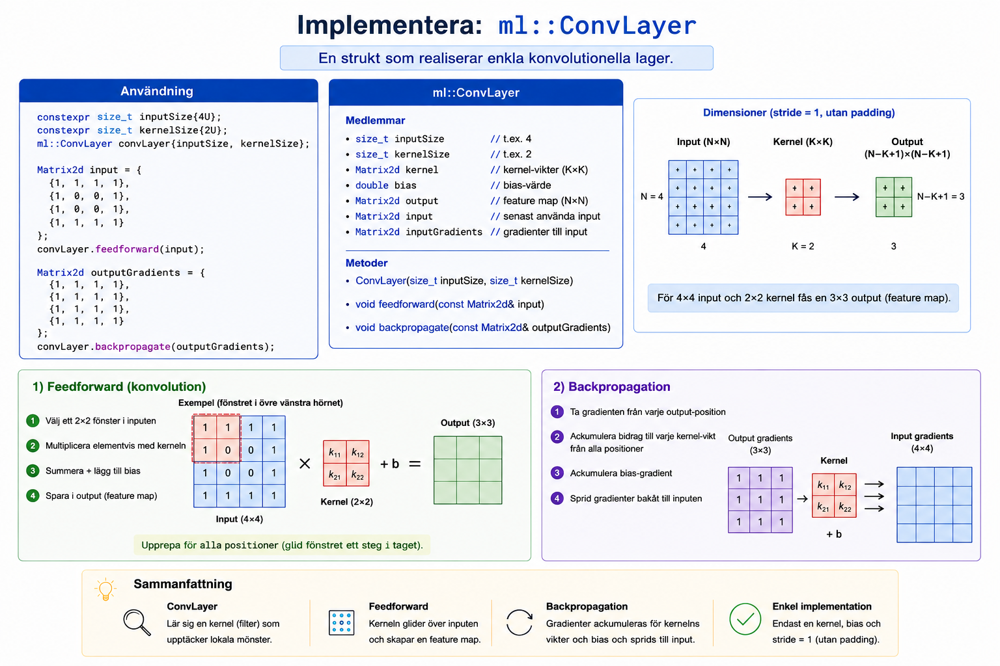

# Bilaga A - Skapande av enkla conv-lager i C++

### Uppgiftsbeskrivning
En strukt döpt `ml::ConvLayer` ska läggas till i [conv_demo.cpp](../conv_layer/cpp/conv_demo.cpp) för att realisera enkla conv-lager. För att hålla det så enkelt som möjligt implementerar vi en strukt och slopar get- och set-metoder, radering av copy- och move-konstruktorer med mera.



Studera koden i funktionen `main()`. Er implementation ska skrivas så att denna kod fungerar:

```cpp
// Create a convolutional layer: 4x4 input, 2x2 kernel.
constexpr std::size_t inputSize{4U};
constexpr std::size_t kernelSize{2U};
ml::ConvLayer convLayer{inputSize, kernelSize};

// Example 4x4 input matrix (could represent an image or feature map).
const Matrix2d input{{1, 1, 1, 1},
                     {1, 0, 0, 1},
                     {1, 0, 0, 1},
                     {1, 1, 1, 1}};

// Perform feedforward (convolution).
convLayer.feedforward(input);

// Example output gradients (target output for demonstration).
const Matrix2d outputGradients{{1, 1, 1, 1},
                               {1, 1, 1, 1},
                               {1, 1, 1, 1},
                               {1, 1, 1, 1}};

// Perform backpropagation.
convLayer.backpropagate(outputGradients);
```

### Kompilering samt exekvering av programmet
Som vanligt kan programmet köras genom att skriva kommandot `make` i terminalen:

```bash
make
```

När implementationen är färdig, avkommentera kompilatorflaggan `CXX_FLAGS` i
[Makefilen](../conv_layer/cpp/Makefile). Ändra alltså från följande:

```bash
# TODO: Uncomment this line once the implementation is finished.
#CXX_FLAGS := -std=c++17 -Wall -Werror -DCONV_LAYER_IMPLEMENTED
```

till

```bash
CXX_FLAGS := -std=c++17 -Wall -Werror -DCONV_LAYER_IMPLEMENTED
```

Ni kan då också ta bort header-guarden `CONV_LAYER_IMPLEMENTED` ur
[conv_demo.cpp](../conv_layer/cpp/conv_demo.cpp) om ni vill. I så fall, ändra alltså från följande:

```cpp
/**
 * @brief Create and demonstrate a simple convolutional layer.
 *
 * @return 0 on success, -1 on failure.
 */
int main()
{
//! @todo Remove this header guard (and/or uncomment the compiler flags in the makefile) once the
//        implementation is finished.
#ifdef CONV_LAYER_IMPLEMENTED

    // Function content.
    return 0;
    
//! @todo Remove this header guard (and/or uncomment the compiler flags in the makefile) once the
//        implementation is finished.
#endif /** CONV_LAYER_IMPLEMENTED */
}
```

till

```cpp
/**
 * @brief Create and demonstrate a simple convolutional layer.
 *
 * @return 0 on success, -1 on failure.
 */
int main()
{
    // Function content.
    return 0;
}
```

---
